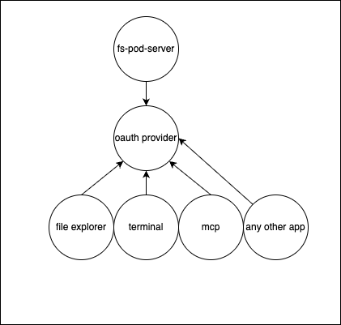

# FS POD-Server

Headless collaborative file system API with real-time WebSocket support and direct SQL access

Demo: https://server.agent-pod.com

OpenAPI spec: https://server.agent-pod.com/openapi.yaml

# CHANGELOG

## Initial creation (2025-09-14)

- ✅ Take `xytext` and strip out all front-end (https://letmeprompt.com/rules-httpsuithu-xjgyzz0)
- ✅ strip out oauth, replace with mcp-compatible oauth (https://github.com/janwilmake/universal-mcp-oauth/tree/main/simplerauth-client)
- ✅ clean up api footprint a bit more. focus on purely necessary for file access.
- ✅ come up with scopes of that apps using this file system may request. definitely needs ability for user to select fs scope, read,write,time-bound, etc. this is cool. needs to be added to simplerauth clients login flow. https://letmeprompt.com/rules-httpsuithu-guuz6k0
- ✅ create a super clear documentation about the API and how to make a client.
- ✅ fix cors error and create demo at https://explorer.agent-pod.com

# TODO

- Let's create ability for DB access with a new client: https://admin.agent-pod.com (requests full scopes, and full scopes should give access to `/query` endpoint)
- Ensure file/folder-creation actually works. Seems not the case now! The GET `/` should actually present available files according to the scopes.
- Once it works, creating apps that have a file system will become much easier:
  - Take [xytext](../xytext/) and build this frontend against this oauth provider. Should store username to access token map to also make everything publicly accessible (read-only).
  - Build a fs MCP
  - build a web-based terminal for it
  - build a fs sync for MacOS so I can keep using browser fs functionality like downloading and selecting files: https://letmeprompt.com/in-which-ways-do-b-3xdzoa0
  - refactor [efficient-recorder](../efficient-recorder/) and [ip-camera-to-s3-macos](../ip-camera-to-s3-macos/) so it oauths into this FS.
- See how this differs from https://solidproject.org/TR/protocol and if its worth refactoring it towards it - https://letmeprompt.com/rules-httpsuithu-wknp8p0
- Add binary file storage by connecting an R2 bucket with username prefix. The node can just have the URL inthere and have `type:binary`, and fetching this can be handled before responding.
- Consider granting read/write scope by default to `clients/{client_id}/*`, reserving this space for any client.

This now opens the door for doing much more because it allows easily making web-based apps that use a central file system without owning the data.
